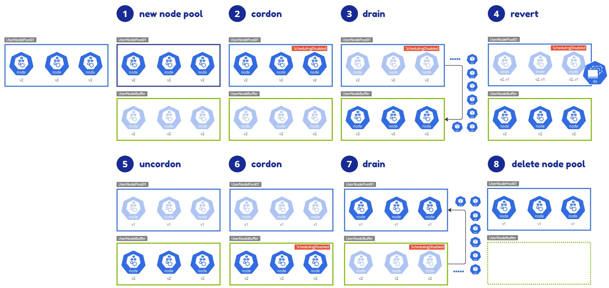
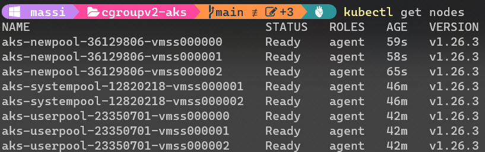
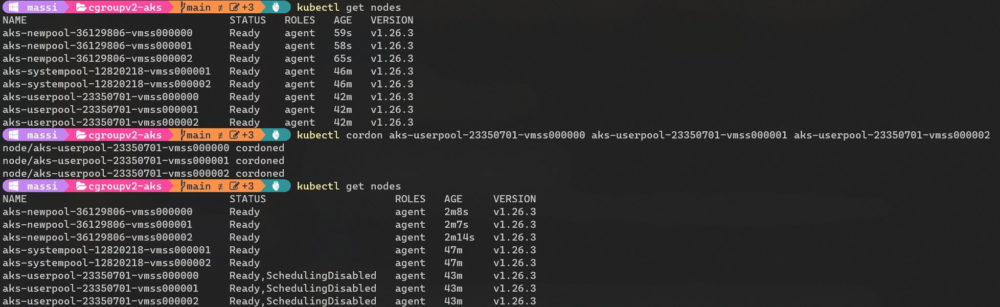
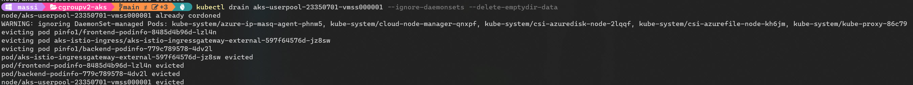
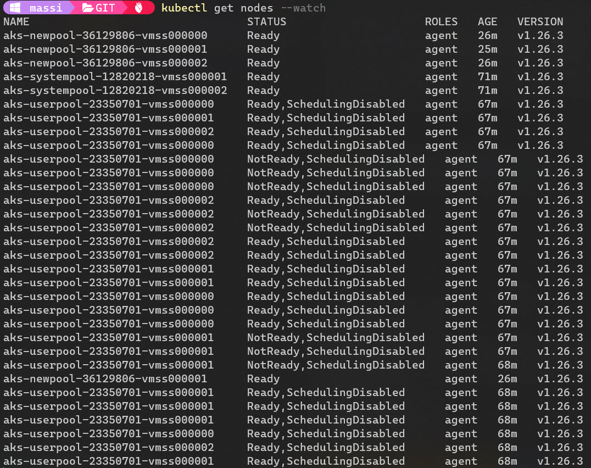
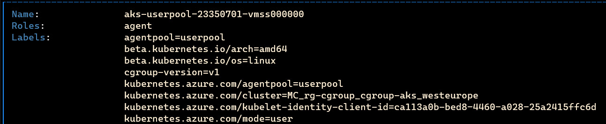

# Infrastructure

Create AKS

```
cd ./infra
sh ./00-infra.sh
```

Deploy the sample app

```
cd ./infra
sh ./01-app.sh
```

# Test the workload

Test the app is working : frontend: http://pinfo1.20.103.50.248.nip.io/

```
# backend

curl -iv http://pinfo1.20.103.50.248.nip.io/version
curl -iv http://pinfo1.20.103.50.248.nip.io/echo
curl -iv http://pinfo1.20.103.50.248.nip.io/env

for i in {1..20};do curl -s -o /dev/null -w "HTTP %{http_code}" http://pinfo1.20.103.50.248.nip.io/version; echo; done
```

# Prepare revert cgroup

Overview




Add a new node pool
```
cd ./infra
sh ./02-newpool.sh
```



# Revert procedure

CORDON

```
kubectl get nodes

# cordon the existing nodes
kubectl cordon aks-userpool-23350701-vmss000000 aks-userpool-23350701-vmss000001 aks-userpool-23350701-vmss000002
```



DRAIN

```
kubectl get nodes

kubectl drain aks-userpool-23350701-vmss000000 --ignore-daemonsets --delete-emptydir-data 
kubectl drain aks-userpool-23350701-vmss000001 --ignore-daemonsets --delete-emptydir-data 
kubectl drain aks-userpool-23350701-vmss000002 --ignore-daemonsets --delete-emptydir-data 

# run a watch command to see the behavior while draining node
kubectl get pods -n pinfo1 --watch
```



REVERT cgroup v2 to cgroup v1

```
kubectl apply -f ./revert_cgroup_v1.yaml

# run a watch command to see the behavior while draining node
kubectl get nodes --watch
```

Watch the nodes while the daemonset is rebooting them



Reverted nodes are labeled with cgroup-version=v1



UNCORDON original nodes

```
kubectl uncordon aks-userpool-23350701-vmss000000
kubectl uncordon aks-userpool-23350701-vmss000001
kubectl uncordon aks-userpool-23350701-vmss000002
```

CORDON buffer nodes

```
kubectl cordon aks-newpool-36129806-vmss000000 aks-newpool-36129806-vmss000001 aks-newpool-36129806-vmss000002
```

DRAIN buffer nodes

```
kubectl drain aks-newpool-36129806-vmss000000 --ignore-daemonsets --delete-emptydir-data
kubectl drain aks-newpool-36129806-vmss000001 --ignore-daemonsets --delete-emptydir-data
kubectl drain aks-newpool-36129806-vmss000002 --ignore-daemonsets --delete-emptydir-data
```

DELETE the buffer node pool

```
az aks nodepool delete --resource-group rg-cgroup --cluster-name cgroup-aks --name newpool
```